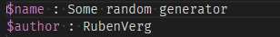
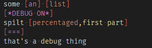

# RandomGen Support

Support for RandomGen.

## Features

### Syntax highlight

#### Lists


##### Additions and roots


![Roots: this image shows a list called '$>root', the greater than sign is colored purple. TRANSCRIPT $>root newline [interpolated] newline [percentaged] {25%} END TRANSCRIPT](img/root.png)

#### Settings



#### Percentages


#### Interpolations

![Interpolations: this image shows a list with three elements, the first has an orange interpoation with red brackets, the second has two inline strings separated by a red pipe, the third has nested interpolations. TRANSCRIPT $interpolated newline green [list] inline [happiness|sadness] newline nested [percentaged|[list| ]|lol] END TRANSCRIPT](img/interpolations.png)

##### Special interpolations and keywords



###### Special interpolations (colored purple, SRs!)

* `[a]`
* `[an]`
* `[===]`
* `[*DEBUG ON*]`
* `[*DEBUG OFF*]`
* `[s]`

###### Keywords to be appended with a comma, (colored yellow, SRs!)

* `first part`
* `middle part`
* `last part`
* `hidden`
* `unique`
* `mundane`
* `title`
* `lower`
* `compress`
* `written`

##### Tags

![Tags: this image shows a list element with an interpolation, inside the brackets are the list identifier and a blue ',#el'. TRANSCRIPT tagged [list,#el] END TRANSCRIPT](img/tags.png)

#### Comments


### Snippets

#### Quick Start

`start` and `settings` both open to

```text
\$name : $1
\$author : $2
\$description : $3
\$amount : ${4:10}
\$picture : $5
\$button : ${6:Go!}
$0
```

#### List

`list` opens to

```text
\$list
element
another element
$0
```

## Known Issues

Comments require a starting space to differentiate them from URLs.

## Release Notes

### 1.0.0

Initial release.
